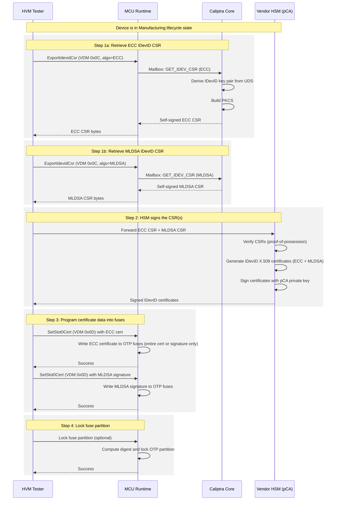
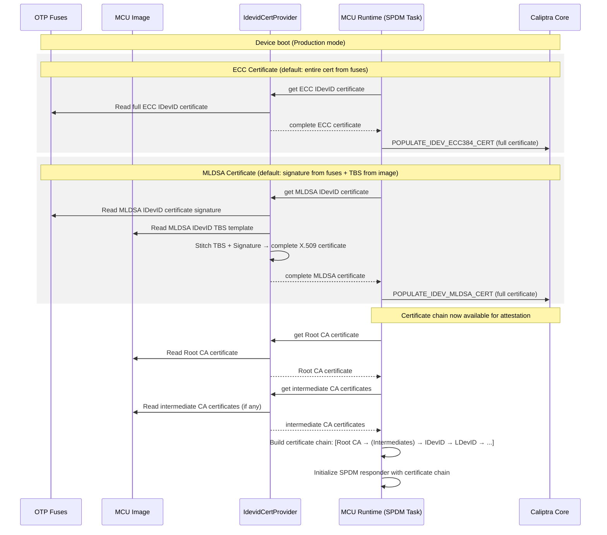
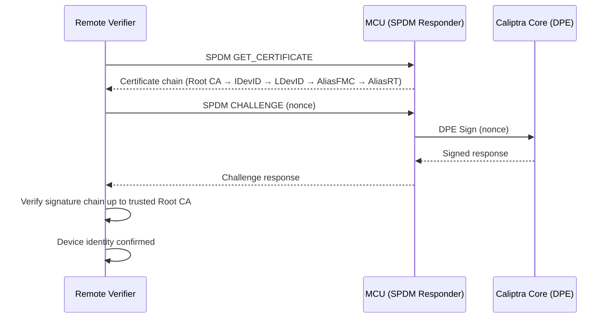

# IDevID Certificate Signature Fuse Provisioning in MCU

## Overview

Each Caliptra-based chip requires a unique cryptographic identity called **IDevID** (Initial Device Identity, per IEEE 802.1AR). This identity is provisioned during manufacturing and persists for the lifetime of the device.

Caliptra Core generates the IDevID key pair and CSR internally, but **does not allocate fuses for the IDevID certificate signature**. It is the SoC integrator's (MCU's) responsibility to store and manage the endorsed IDevID certificate.

This document describes the provisioning flow, the data model, and the MCU implementation.

---

## Background Concepts

### X.509 Certificate Structure

An X.509 certificate consists of three parts:

```
┌─────────────────────────────┐
│  TBS (To-Be-Signed)         │  ← Subject, public key, extensions, validity, etc.
├─────────────────────────────┤
│  Signature Algorithm ID     │  ← e.g., ecdsa-with-SHA384
├─────────────────────────────┤
│  Signature Value            │  ← Cryptographic signature over the TBS
└─────────────────────────────┘
```

- **TBS**: Contains all certificate data (subject name, public key, validity period, extensions). For template-based certificates, the TBS structure is mostly fixed per product line — only device-specific fields (public key, serial number, Subject Key Identifier) vary.
- **Signature**: The HSM's cryptographic endorsement of the TBS. Unique per device.

### Key Terms

| Term | Definition |
|------|-----------|
| **IDevID** | Initial Device Identity — a permanent, non-renewable cryptographic identity |
| **CSR** | Certificate Signing Request — a PKCS#10 message containing the device's public key, sent to a CA for endorsement |
| **HSM** | Hardware Security Module — a tamper-resistant device that holds the vendor's CA private key and performs signing |
| **HVM** | High Volume Manufacturing — the production environment where devices are provisioned |
| **pCA** | Provisioning Certificate Authority — the vendor's CA that signs IDevID certificates |
| **TBS** | To-Be-Signed — the data portion of a certificate (everything except the signature) |
| **UDS** | Unique Device Secret — per-device entropy used to derive the IDevID key pair |
| **OTP** | One-Time Programmable fuses |

---

## Certificate Storage Model

### Fuse Storage Options

Integrators have flexibility in how much of the certificate is stored in OTP fuses versus embedded in the MCU runtime binary. The options vary by algorithm due to size constraints:

| Algorithm | Option | Fuse Usage | Binary Usage | Fuse Size |
|-----------|--------|-----------|-------------|-----------|
| **ECC P384** | Entire cert in fuses | Full DER certificate | Root CA cert only | ~547 bytes |
| **ECC P384** | Signature only in fuses | Signature (R ‖ S) | TBS + Root CA cert | 96 bytes |
| **MLDSA-87** | Entire cert in fuses | Full DER certificate | Root CA cert only | ~7–8 KB |
| **MLDSA-87** | Signature only in fuses | Signature | TBS + Root CA cert | 4627 bytes |

### Current Vendor Fuse Availability

The OTP controller has 16 partitions. Partitions 0–8, 10–12, and 15 are allocated to Caliptra core. The following vendor partitions have unallocated space:

| Partition | Name | Available Slots | Total Available | Type |
|-----------|------|----------------|----------------|------|
| P9 | `vendor_test_partition` | 1 entry | 56 bytes | Non-secret |
| P13 | `vendor_secret_prod_partition` (slots 1–15) | 15 entries × 32 bytes | 480 bytes | Secret (scrambled) |
| P14 | `vendor_non_secret_prod_partition` (slots 5–15) | 11 entries × 32 bytes | 352 bytes | Non-secret |
| | **Total** | | **888 bytes** | |

Already allocated in vendor partitions: P13 slot 0 (`vendor_recovery_pk_hash`), P14 slots 0–4 (DOT init/state, TRNG config).

**Fit analysis:**

| Data | Size | Fits in current OTP? |
|------|------|---------------------|
| ECC signature only | 96 bytes | **Yes** — 3 slots in P14 |
| ECC full cert | ~547 bytes | **No** — exceeds P14 (352 bytes); P13 has 480 bytes but is secret/scrambled |
| MLDSA signature | 4,627 bytes | **No** — exceeds all available space (888 bytes total) |
| MLDSA full cert | ~7–8 KB | **No** |

> **Action needed**: The current OTP partition sizes are insufficient for the ECC full cert and MLDSA signature. The fuse controller partition config (`gen_fuse_ctrl_partitions.yml`) may need to be expanded. Confirm with Chris.

### Recommended Defaults

- **ECC**: Entire signed certificate in fuses (recommended — the cert is small enough at ~547 bytes)
- **MLDSA**: Signature only in fuses, TBS template embedded in MCU runtime binary (the full MLDSA cert is ~7–8 KB which is large for fuses; some vendors like Marvell will only allocate fuses for the signature)

---

## Manufacturing Provisioning Flow

### Prerequisites

- Device lifecycle is in **Manufacturing mode** (IDevID CSR generation only works in this state)
- UDS and IDevID certificate attribute fuses have been programmed
- Caliptra firmware is loaded and running

### Sequence Diagram




---

## Embedding Certificate Data in the Firmware Image

When only the IDevID certificate **signature** is written to OTP fuses
(e.g. the MLDSA default), the MCU runtime still needs the **TBS**
portion to reconstruct the full X.509 certificate at boot. The TBS must
be stored somewhere the firmware can access. This section proposes using the
firmware image builder to prepend the Root CA certificate and IDevID TBS
template(s) to the MCU firmware image as an optional header, following
the same pattern as the
[DOT manifest section](./firmware_format.md#firmware-manifest-dot-section).
 
### Proposed Header: IDevID Certificate Data Section

Following the conventions in [firmware_format.md](./firmware_format.md):

| Offset | Size | Field | Description |
|--------|------|-------|-------------|
| 0x00 | 4 | `magic` | `FW_MANIFEST_CERT_MAGIC` (u32, little-endian) |
| 0x04 | 4 | `checksum` | ones-complement of the u32 sum of bytes\[8..end\] |
| 0x08 | 4 | `version` | format version (must be 1) |
| **0x0C** | **4** | **`flags`** | **bit 0: `root_ca_present`, bit 1: `intermediate_ca_present`, bit 2: `ecc_tbs_present`, bit 3: `mldsa_tbs_present`** |
| **0x10** | **4** | **`root_ca_offset`** | **offset from section start to Root CA cert data** |
| **0x14** | **4** | **`root_ca_size`** | **size of Root CA cert (DER-encoded), 0 if absent** |
| **0x18** | **4** | **`inter_ca_offset`** | **offset to intermediate CA cert data** |
| **0x1C** | **4** | **`inter_ca_size`** | **size of intermediate CA cert, 0 if absent** |
| **0x20** | **4** | **`ecc_tbs_offset`** | **offset to ECC IDevID TBS template** |
| **0x24** | **4** | **`ecc_tbs_size`** | **size of ECC TBS template, 0 if absent** |
| **0x28** | **4** | **`mldsa_tbs_offset`** | **offset to MLDSA IDevID TBS template** |
| **0x2C** | **4** | **`mldsa_tbs_size`** | **size of MLDSA TBS template, 0 if absent** |
| 0x30 | 4 | `_reserved` | must be zero |
| 0x34 | vary | **`data`** | **concatenated cert/TBS blobs at declared offsets** |


### Image Layout (with certificate section)

```
+-----------------------------------------+ <- MCU_MEMORY_MAP.sram_offset
| McuImageHeader (SVN, 8 bytes)           |
+-----------------------------------------+
| FW Manifest DOT section (128 bytes)     |   ← optional
+-----------------------------------------+
| FW Manifest Cert section (variable)     |   ← NEW, optional
+-----------------------------------------+
| MCU runtime firmware (reset vector, ...)|
+-----------------------------------------+
```

The ROM does not need to interpret the certificate section — it only
needs to recognize the magic and skip past it (advancing the firmware
entry offset by the section size). Certificate data is consumed by the
**MCU runtime** after boot, not by the ROM.

### Firmware Image Builder Integration

The firmware image builder (`firmware-bundler`) would accept new
command-line arguments:

```
--root-ca-cert <path>       DER-encoded Root CA certificate
--intermediate-ca-cert <path>  DER-encoded intermediate CA certificate (optional)
--idevid-ecc-cert <path>   DER-encoded ECC IDevID certificate  (optional)
--idevid-mldsa-cert <path> DER-encoded MLDSA IDevID TBS certificate (optional)
```

---

## Boot-Time Certificate Reconstruction

On every subsequent boot, the MCU runtime reconstructs the full IDevID certificate(s) from their components and provides them to Caliptra. This must happen in **MCU runtime** (not ROM), since the ROM is already loaded before provisioning occurs.

For **ECC** (default: entire cert in fuses):
- Read the full DER-encoded certificate directly from OTP fuses
- Send to Caliptra via `POPULATE_IDEV_ECC384_CERT`

For **MLDSA** (default: signature only in fuses):
- Read the TBS template from the MCU runtime binary (static data)
- Read the signature from OTP fuses
- Stitch TBS + signature algorithm ID + signature → complete X.509 certificate
- Send to Caliptra via `POPULATE_IDEV_MLDSA_CERT`



---

## Attestation Flow (Post-Provisioning)

Once the certificate chain is established, the device can respond to attestation challenges.



---

## VDM Commands

### ExportIdevidCsr (0x0C)

Retrieves the IDevID Certificate Signing Request from Caliptra for a specified algorithm.

- **Input**: Algorithm parameter — ECC or MLDSA
- **Precondition**: Device must be in **Manufacturing** lifecycle state
- **Response**: Self-signed PKCS#10 CSR bytes for the requested algorithm
- **Note**: Called once per algorithm (ECC and MLDSA separately). The Caliptra runtime returns individual self-signed CSRs (not the ROM-phase HMAC envelope). The standard PKI flow applies — the pCA verifies the CSR and signs it.
- **Status**: ECC version implemented by Parvathi; MLDSA retrieval TBD (may use a separate mailbox command)

### SetSlot0Cert (0x0D)

Programs the IDevID certificate data into fuses.

- **Input**: Certificate data — either:
  - Full DER-encoded certificate (for ECC, ~547 bytes), or
  - Signature bytes only (96 bytes for ECC, 4627 bytes for MLDSA)
- **Action**: Writes certificate data to integrator-defined OTP fuses via MCU
- **Status**: Command defined but **not yet implemented** (returns `InvalidCommand`)
- **Note**: May need to be called twice during provisioning — once for ECC, once for MLDSA

### GetSlot0State (0x0E)

Queries the provisioning state of slot 0.

- **Response**: Whether the IDevID certificate has been provisioned
- **Status**: Command defined but **not yet implemented**

---

## Code Architecture

### Current State (Temporary)

The entire signed IDevID certificate is hardcoded as a static byte array:

```
platforms/emulator/runtime/userspace/apps/user/src/spdm/
├── endorsement_certs/
│   ├── mod.rs              ← populate_idev_cert() reads static cert & sends to Caliptra
│   └── slot0.rs            ← SLOT0_ECC_DEVID_CERT_DER (full cert, hardcoded)
├── cert_store/             ← Certificate store trait implementations
├── device_cert_store.rs    ← Global cert store with static storage
└── mod.rs                  ← SPDM task entry point
```

### Target State (After Implementation)

```
platforms/emulator/runtime/userspace/apps/user/src/spdm/
├── endorsement_certs/
│   ├── mod.rs              ← populate_idev_cert() reads fuses + TBS, stitches, sends to Caliptra
│   └── slot0.rs            ← Root CA cert (static) + Intermediate CA certs (static) + IDevID TBS template (static, MLDSA only)
├── cert_store/             ← Certificate store trait implementations
└── ...

common/mctp-vdm/src/protocol/
└── commands.rs             ← SetSlot0Cert command handling

runtime/userspace/api/spdm-lib/src/vdm_handler/
└── caliptra_vdm/mod.rs     ← SetSlot0Cert VDM handler (fuse write logic)
```

### Key Interfaces

```rust
/// Trait for integrators to customize IDevID certificate storage.
///
/// Default impl (ECC): full cert → OTP fuses
/// Default impl (MLDSA): sig → OTP fuses, TBS → binary
/// Integrators can override for custom storage.
pub trait IdevidCertProvider {
    type Error;

    /// Write the full certificate or signature bytes to OTP fuses.
    fn store_idevid_cert(&self, cert: &[u8]) -> Result<(), Self::Error>;

    /// Read the certificate or signature bytes from OTP fuses.
    fn read_idevid_cert(&self, buf: &mut [u8]) -> Result<usize, Self::Error>;

    /// Return the TBS template from the firmware binary, or `None` if the
    /// full certificate is stored in fuses (e.g. ECC default).
    fn read_idevid_tbs(&self) -> Option<&[u8]>;

    /// Reconstruct the complete DER-encoded X.509 certificate.
    /// If TBS is available, stitches TBS + signature; otherwise returns
    /// the full certificate read from fuses.
    fn reconstruct_idevid_cert(&self, buf: &mut [u8]) -> Result<usize, Self::Error>;

    /// Return the Root CA certificate (embedded in the firmware binary).
    fn read_root_ca_cert(&self) -> &[u8];
}
```

---

## Fuse Layout

The IDevID certificate signature fuses are **integrator-defined** — Caliptra does not prescribe their location. Per the spec:

> "Caliptra does not allocate fuses in its fuse map for the IDevID certificate signature."

For the default/emulator implementation:

| Field | Size (ECC) | Size (MLDSA) | Notes |
|-------|-----------|-------------|-------|
| IDevID cert (full, default for ECC) | ~547 bytes | ~7–8 KB | ECC default: full cert in fuses |
| IDevID cert signature only (default for MLDSA) | 96 bytes | 4627 bytes | MLDSA default: signature only |

These fuses are:
- **Read/written by MCU only** (not by Caliptra Core)
- Programmed during manufacturing after HSM endorsement
- Locked (partition digest) before transitioning to Production lifecycle

---

## Open Items

1. **Fuse partition assignment** — Which OTP partition(s) the certificate fuses belong to. Need to check with Chris on how fuses are defined in the emulator vs. FPGA and whether spare fuses are already available.
2. **MLDSA CSR retrieval** — Whether `ExportIdevidCsr` needs a separate mailbox command for MLDSA CSRs, or if the existing command can handle both.
3. **MLDSA TBS template format** — Exact structure of the TBS template for MLDSA certificates; similar to the existing Caliptra template approach.
4. **Error handling** — Behavior when fuses are already programmed (re-provisioning attempt).
5. **ECC consistency option** — Vishal suggested that for consistency, even ECC could use signature-only-in-fuses (matching MLDSA). Confirm with Vishal Soni whether the default should be full-cert-in-fuses (saves runtime complexity) or signature-only (consistent approach).
6. **CSR HMAC envelope** — During ROM manufacturing flow, the CSR envelope bundles both ECC + MLDSA CSRs with an HMAC tag for integrity. The HMAC key is burnt into hardware; the integrator's HSM/pCA should have the key. This is noted for future reference but is not blocking the runtime-based provisioning flow.

---

## References

- [Caliptra 2.0 Specification — Provisioning IDevID During Manufacturing](https://chipsalliance.github.io/Caliptra/2.0/specification/HEAD/#sec:idev-during-manufacturing)
- [Caliptra 2.0 Specification — IDevID Certificate Format](https://chipsalliance.github.io/Caliptra/2.0/specification/HEAD/#idevid-certificate)
- [Caliptra 2.0 Specification — Fuse Map](https://chipsalliance.github.io/Caliptra/2.0/specification/HEAD/#fuse-map)
- [IEEE 802.1AR — Secure Device Identity](https://1.ieee802.org/security/802-1ar/)
- [PKCS#10 — Certificate Signing Request](https://datatracker.ietf.org/doc/html/rfc2986)

---

## Appendix A: Alternative — Signature Hash in Fuses with Per-Device Firmware

If OTP partition sizes cannot be expanded to fit the MLDSA signature (4,627 bytes), an alternative is to store a **hash of the signature** in fuses.

### How It Works

1. During manufacturing, the HSM signs the CSR and produces the MLDSA signature
2. The provisioning tool computes `SHA-384(signature)` → 48 bytes
3. The 48-byte hash is written to OTP fuses (fits in 2 slots of P14)
4. The full MLDSA signature is embedded in the device's firmware image (per-device build)
5. At boot, the MCU reads the signature from the firmware image, computes `SHA-384(signature)`, and compares against the fused hash
6. If the hash matches, the MCU reconstructs the certificate (TBS + signature) and provides it to Caliptra

### Fuse Usage

| Data | Size | Partition |
|------|------|-----------|
| SHA-384 hash of MLDSA signature | 48 bytes | P14 (2 slots) |
| ECC full cert (unchanged) | ~547 bytes | Requires expanded partition |
| ECC signature only (unchanged) | 96 bytes | P14 (3 slots) |

### Trade-offs

| Aspect | Signature in fuses (preferred) | Hash in fuses (alternative) |
|--------|-------------------------------|----------------------------|
| Fuse usage (MLDSA) | 4,627 bytes | 48 bytes |
| Firmware image | Shared across all devices | **Per-device** (unique signature embedded) |
| Immutability of signature | Physically immutable (OTP) | Software-enforced (hash check in mutable code) |
| Fleet firmware updates | Single image for all devices | Must carry per-device signature data |
| Manufacturing complexity | Fuse programming only | Fuse programming + per-device image build |

### Security Considerations

- **Weaker integrity model**: The hash verification runs in the same mutable firmware that contains the signature. A malicious firmware update could simultaneously replace the signature and bypass the hash check. With signature-in-fuses, the signature is physically immutable regardless of firmware state.
- **Mitigated by verified boot**: Caliptra's measured boot ensures only vendor-signed firmware runs, so unauthorized firmware modifications are blocked at a higher level.
- **Remote verifier is the ultimate backstop**: In both approaches, the remote verifier validates the certificate chain against the trusted Root CA. A tampered certificate will fail verification regardless of where the signature is stored.

### Recommendation

This approach is a viable fallback if OTP expansion is not feasible, but expanding the fuse controller partitions (preferred) provides stronger security guarantees and avoids the operational complexity of per-device firmware images.

---

## Appendix B: Alternative — Certificate Data as a Separate "SoC Image"

Instead of embedding certificate data (TBS, signature, Root CA) in the MCU runtime binary, the certificate data could be packaged as a **separate image component**. This follows the same pattern as other vendor SoC images — loaded from flash or streamed via PLDM from a BMC.

